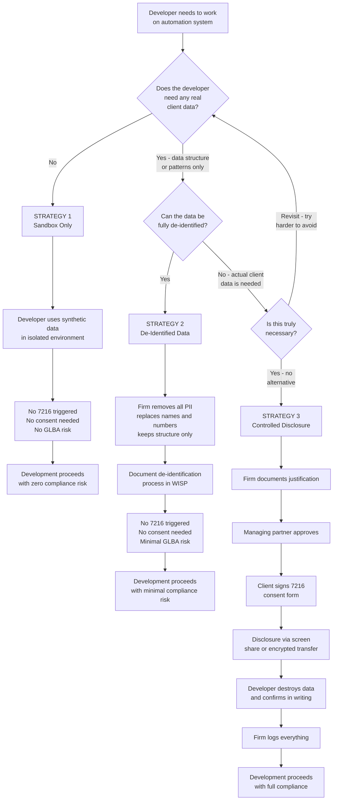

# IRS COMPLIANCE GUIDE

## Maintaining Tax Data Compliance When Outsourcing Automation Development

**Version:** 1.0
**Date:** _______________
**Prepared for:** Firm Principals and Engagement Managers

---

## 1. OVERVIEW

This guide explains how to engage a third-party developer to build workflow
automation for your tax practice while remaining fully compliant with IRS
regulations, federal privacy laws, and professional standards. It provides
three compliance strategies ranked by preference and details when each
applies.

---

## 2. REGULATORY LANDSCAPE

### 2.1 IRC Section 7216 — Disclosure of Tax Return Information

**What it is:** A federal criminal statute that prohibits tax return preparers
from knowingly or recklessly disclosing tax return information without
the taxpayer's consent.

**Penalty:** Misdemeanor — up to 1 year imprisonment and/or $1,000 fine per
violation. Civil damages may also apply under IRC Section 7431.

**What counts as "tax return information":**
- Any information furnished by, or on behalf of, a taxpayer in connection
  with the preparation of a tax return
- This is interpreted broadly: income figures, deduction amounts, entity
  structures, financial statements used for tax prep, payroll data used
  for W-2 preparation, and even the fact that someone is a client

**Who is bound:**
- The tax return preparer (the Firm)
- Any person who is an employee, agent, or contractor of the preparer
  who has access to tax return information
- This includes IT contractors, software developers, and consultants
  if they access tax return information

**Key distinction:** 7216 is triggered by **disclosure** — the act of making
tax return information available to someone. If the developer never sees,
accesses, or receives tax return information, no disclosure occurs, and
7216 is not triggered.

### 2.2 Treasury Regulation 301.7216

**Defines "tax return information" as:**
> Information furnished in any form or manner for, or in connection with,
> the preparation of a tax return of the taxpayer. This includes information
> received by the preparer from the taxpayer, from a third party, or from
> any other source.

**Important exceptions relevant to this engagement:**

- **Reg. 301.7216-2(d):** Disclosure to contractors is permitted WITHOUT
  taxpayer consent if the contractor provides "auxiliary services" such as
  processing, printing, or reproduction of returns — BUT this exception
  requires a written confidentiality agreement and is narrowly interpreted.
  Software development may not clearly fall within "auxiliary services."

- **Reg. 301.7216-2(o):** Disclosure is permitted if necessary for the
  purpose of a "tax return preparer's computer system" — but again, this
  is narrowly interpreted and may not cover development-phase access by
  an external developer.

**Bottom line:** The safest path is to avoid disclosure entirely, rather than
relying on exceptions that may be challenged.

### 2.3 Gramm-Leach-Bliley Act (GLBA)

**What it is:** Federal law requiring "financial institutions" (including
tax preparers) to protect customer nonpublic personal information (NPI).

**Requirements:**
- Maintain a Written Information Security Plan (WISP)
- Assess risks to customer information, including those posed by
  third-party service providers
- Contractually require third parties to maintain appropriate safeguards

**Impact on this engagement:**
- Your WISP must reference this third-party engagement
- Your service agreement must include data security provisions
  (covered in the Service Agreement, Part 2)
- You must verify the developer's security practices

### 2.4 FTC Safeguards Rule (16 CFR Part 314)

**What it is:** Implements the GLBA requirement for financial institutions
to safeguard customer information.

**Key requirements:**
- Designate a qualified individual to oversee the security program
- Conduct risk assessments
- **Oversee service providers**: Take reasonable steps to select and retain
  service providers that maintain appropriate safeguards, and contractually
  require them to do so
- Monitor and test safeguards

**Impact:** You must document your evaluation of the developer's security
practices and maintain records of the contractual safeguards.

### 2.5 IRS Publication 4557 — Safeguarding Taxpayer Data

**What it is:** IRS guidance document for tax professionals on protecting
taxpayer data.

**Key recommendations:**
- Use a Written Information Security Plan (WISP)
- Encrypt all taxpayer data
- Limit access to taxpayer data to those who need it
- Vet third-party service providers
- Have a data breach response plan

**Impact:** Your WISP should include procedures for engaging third-party
developers, consistent with this guide.

### 2.6 State-Level Regulations

Many states have their own data breach notification laws and professional
conduct rules for CPAs and tax preparers. Consult your state board of
accountancy for specific requirements. Common state requirements include:

- Data breach notification within a specified timeframe
- Specific data security standards for personal information
- Professional conduct rules regarding client confidentiality
- State tax preparer registration requirements

---

## 3. THREE COMPLIANCE STRATEGIES

### Strategy 1: Complete Data Isolation (RECOMMENDED)

**No 7216 consent required. No GLBA third-party risk.**

```
┌────────────────────────────────────────────────────────────────┐
│                    DEVELOPER ENVIRONMENT                        │
│                                                                  │
│   ┌──────────────┐  ┌──────────────┐  ┌──────────────┐         │
│   │  n8n          │  │  QBO         │  │  Google      │         │
│   │  (own         │  │  Sandbox     │  │  Test        │         │
│   │   instance)   │  │  (Intuit     │  │  Account     │         │
│   │              │  │   Developer) │  │              │         │
│   └──────────────┘  └──────────────┘  └──────────────┘         │
│                                                                  │
│   Data: 100% synthetic / fabricated                              │
│   Client names: "Jane Testclient", "Acme Test Corp"             │
│   Financial figures: Completely made up                           │
│   SSN/EIN: 000-00-0000 / 00-0000000                             │
│                                                                  │
│   ═══════════════════════════════════════════════════════        │
│   RESULT: No tax return information is disclosed.                │
│   7216 is NOT triggered. No client consent needed.               │
│   ═══════════════════════════════════════════════════════        │
└──────────────────────┬─────────────────────────────────────────┘
                       │
                       │ Developer delivers workflow JSON
                       │ exports, templates, documentation
                       │ (no client data in any deliverable)
                       ▼
┌────────────────────────────────────────────────────────────────┐
│                    FIRM PRODUCTION ENVIRONMENT                   │
│                                                                  │
│   Firm imports workflows, connects own API credentials,          │
│   tests with real client data independently.                     │
│                                                                  │
│   All client data stays within Firm-controlled systems.          │
└────────────────────────────────────────────────────────────────┘
```

**How to implement:**
1. Developer sets up their own n8n instance
2. Developer creates a free QBO sandbox at developer.intuit.com
3. Developer uses a personal/test Google account for Google integrations
4. Developer populates all systems with synthetic data
5. Developer builds, tests, and validates entirely in sandbox
6. Developer exports workflow JSONs and templates
7. Firm imports into production and connects real credentials
8. Developer provides support only via screen share where Firm controls screen

**Advantages:**
- Zero regulatory risk
- No client consent forms needed
- No ongoing compliance monitoring of developer's data handling
- Simplest to execute
- Cleanest from an audit standpoint

**Limitations:**
- Developer cannot troubleshoot issues that only appear with real data
  (edge cases in specific client QBO setups, unexpected data formats)
- May require more back-and-forth during testing — Firm describes the
  issue with sanitized data, Developer fixes in sandbox

**When to use:** Always. This should be the default for the entire engagement.

---

### Strategy 2: De-Identified Data Sharing (FALLBACK)

**No 7216 consent required if properly de-identified. Minimal GLBA risk.**

Sometimes the Developer needs to understand real-world data patterns that
synthetic data doesn't capture — for example, the exact format of QBO
transaction descriptions, or how a specific payroll report structures its
fields.

```
┌────────────────────────────────────────────────────────────────┐
│                    FIRM PREPARES DATA                            │
│                                                                  │
│   Takes real data sample and removes:                            │
│   ✗ Client names → replaced with "Client A"                     │
│   ✗ SSN/EIN → removed entirely                                  │
│   ✗ Account numbers → removed or replaced with fake             │
│   ✗ Dollar amounts → optionally multiplied by random factor     │
│   ✗ Specific dates → optionally shifted by random offset        │
│   ✗ Employee names → replaced with "Employee 1"                 │
│   ✗ Business names → replaced with "Test Business"              │
│                                                                  │
│   Keeps:                                                         │
│   ✓ Data structure and field names                               │
│   ✓ Category names and chart of accounts structure               │
│   ✓ Transaction description patterns (e.g., "SAFECO DEP")       │
│   ✓ Report column layouts                                       │
│   ✓ Number of rows / general data volume                        │
│                                                                  │
│   ═══════════════════════════════════════════════════════        │
│   RESULT: De-identified data is no longer "tax return            │
│   information" because it cannot identify any taxpayer.          │
│   7216 is NOT triggered.                                         │
│   ═══════════════════════════════════════════════════════        │
└──────────────────────┬─────────────────────────────────────────┘
                       │
                       │ Firm sends de-identified sample
                       │ to Developer via encrypted channel
                       ▼
┌────────────────────────────────────────────────────────────────┐
│                    DEVELOPER USES SAMPLE                         │
│                                                                  │
│   Developer uses de-identified sample to understand              │
│   real data patterns, then builds/adjusts workflows              │
│   in sandbox.                                                    │
│                                                                  │
│   Developer destroys de-identified samples when done.            │
└────────────────────────────────────────────────────────────────┘
```

**How to implement:**
1. Firm identifies the specific data sample needed
2. Firm creates a de-identified copy using the checklist above
3. Firm reviews de-identified data to ensure no PII remains
4. Firm sends via encrypted channel (password-protected zip,
   or restricted Google Drive link)
5. Developer uses sample for development, then destroys it
6. Firm documents: what was shared, when, and the de-identification
   steps taken

**Important legal note:** The IRS has not issued definitive guidance on
whether de-identified tax return information remains "tax return information"
under 7216. The conservative position is that if the information was
originally furnished in connection with tax return preparation, it may
still be covered even if de-identified. However, the practical risk is
minimal when proper de-identification removes all taxpayer identifiers,
because:
- The purpose of 7216 is to protect taxpayer privacy
- De-identified data that cannot be re-linked to a taxpayer does not
  threaten taxpayer privacy
- The IRS is unlikely to pursue enforcement against properly de-identified,
  non-re-identifiable data shared for legitimate business purposes

**To strengthen this position:**
- Document your de-identification process
- Ensure non-re-identifiability (don't share unique transaction patterns
  that could identify a specific business)
- Include the de-identification protocol in your WISP

**When to use:** When the Developer encounters a data format or edge case
that can't be replicated in sandbox, and synthetic data is insufficient
to solve the problem.

---

### Strategy 3: Controlled Disclosure with 7216 Consent (LAST RESORT)

**7216 consent required. Full GLBA third-party oversight required.**

In rare cases, the Developer may need to see actual client data to resolve
a critical integration issue — for example, a specific QBO configuration
that causes the workflow to fail and cannot be reproduced in sandbox.

```
┌────────────────────────────────────────────────────────────────┐
│                    BEFORE DISCLOSURE                             │
│                                                                  │
│   1. Firm documents why Strategies 1 and 2 are insufficient     │
│   2. Firm's managing partner approves the disclosure             │
│   3. Affected client(s) sign 7216 consent form                  │
│   4. Developer has executed NDA + Service Agreement              │
│   5. Disclosure is limited to minimum necessary data             │
└──────────────────────┬─────────────────────────────────────────┘
                       │
                       ▼
┌────────────────────────────────────────────────────────────────┐
│                    CONTROLLED DISCLOSURE                         │
│                                                                  │
│   Method: Live screen share ONLY (Firm shares screen)            │
│   Duration: Limited to specific troubleshooting session          │
│   Recording: Developer does NOT record the session               │
│   Data retention: Developer does NOT receive copies of data      │
│   Logging: Firm logs the session (date, duration, data shown)    │
│                                                                  │
│   OR (if screen share is insufficient):                          │
│                                                                  │
│   Method: Firm exports specific data subset                      │
│   Transmission: Encrypted, password-protected                    │
│   Duration: Developer accesses for defined period only           │
│   Destruction: Developer confirms destruction in writing         │
│   Logging: Firm logs all details                                 │
└────────────────────────────────────────────────────────────────┘
```

**7216 Consent Requirements (Revenue Procedure 2013-14):**

The consent form must include:
1. The name of the tax return preparer (your Firm)
2. The name of the taxpayer whose information will be disclosed
3. The name of the recipient (the Developer)
4. A description of the information to be disclosed
5. The purpose of the disclosure
6. The date the consent expires
7. A statement that the taxpayer is not required to consent and that
   declining will not affect services
8. The taxpayer's signature and date

**Additional safeguards when using Strategy 3:**
- Update your WISP to include the third-party access
- Document the business justification
- Limit scope to the absolute minimum data needed
- Set a consent expiration date (recommend 90 days or less)
- Conduct a follow-up to confirm data destruction

**When to use:** Only when both Strategy 1 and Strategy 2 have failed to
resolve a specific technical issue. This should be the exception, not the
rule. Most engagements should complete entirely under Strategy 1.

---

## 4. COMPLIANCE DECISION FLOWCHART



---

## 5. WISP UPDATE CHECKLIST

When engaging a third-party developer, update your Written Information
Security Plan to include:

- [ ] **Third-Party Risk Assessment**
  - Developer's name and contact information
  - Services being provided
  - Data the developer will access (ideally: none)
  - Security assessment performed (NDA, Service Agreement reviewed)

- [ ] **Compliance Strategy Selected**
  - [ ] Strategy 1 (Sandbox Only) — document this as the standard
  - [ ] Strategy 2 (De-Identified) — document the de-identification protocol
  - [ ] Strategy 3 (7216 Consent) — document justification and consent forms

- [ ] **Contractual Safeguards**
  - [ ] NDA executed (date: _______)
  - [ ] Service Agreement executed (date: _______)
  - [ ] Data Security Addendum executed (date: _______)

- [ ] **Monitoring Plan**
  - How you will verify the developer complies with data restrictions
  - Schedule for reviewing developer's compliance (quarterly or per milestone)

- [ ] **Incident Response**
  - Updated contact information for breach notification
  - Steps if the developer reports a security incident

- [ ] **Termination Procedures**
  - Data destruction requirements
  - Confirmation of destruction documentation

---

## 6. AUDIT TRAIL — WHAT TO DOCUMENT

Keep the following records for a minimum of 3 years (or longer per your
state's requirements):

| Document | Purpose | Retention |
|----------|---------|-----------|
| Executed NDA | Proves confidentiality obligations were established | Duration of agreement + 5 years |
| Executed Service Agreement | Proves data security requirements were contractual | Duration + 5 years |
| Developer security assessment notes | Proves due diligence under FTC Safeguards Rule | 3 years minimum |
| WISP update | Proves you assessed third-party risk | Life of WISP |
| De-identification logs (if Strategy 2 used) | Proves proper de-identification | 3 years minimum |
| 7216 consent forms (if Strategy 3 used) | Proves lawful disclosure | 3 years after consent expiration |
| Disclosure logs (if Strategy 3 used) | Proves limited, controlled access | 3 years minimum |
| Data destruction confirmations | Proves developer no longer holds data | 3 years minimum |
| Screen share session logs | Proves controlled access methodology | 3 years minimum |

---

## 7. COMMON SCENARIOS AND CORRECT RESPONSES

### Scenario A: Developer asks "Can you send me a sample QBO export?"
**Correct response:** "I'll send you a sample from our QBO sandbox account
with synthetic data. If you need to see real data patterns, I'll create a
de-identified version with all client names, numbers, and amounts replaced."

### Scenario B: Developer says "I need to log into your QBO to test the API"
**Correct response:** "We'll provide you with Intuit sandbox credentials.
After you deliver the workflows, we'll connect our production QBO ourselves
and test independently. If there's an issue, we can screen share where
I control the screen."

### Scenario C: Developer needs to debug a workflow that fails with real data
**Correct response:** "Let me reproduce the issue with de-identified data
first. I'll export the problematic transaction list, replace all names and
amounts, and send you that. If we can't reproduce it that way, we'll do a
screen share where I share my screen and you guide me through the debugging."

### Scenario D: Developer asks for "just one client's data to test with"
**Correct response:** "We can't share real client data without formal consent
under IRS regulations. Let me create a synthetic dataset that matches the
client's data structure and complexity. What specific characteristics do
you need — entity type, number of accounts, transaction volume?"

### Scenario E: Client asks "Who has access to my data?"
**Correct response:** "Only our authorized team members. Our automation
developer built the workflow systems using synthetic test data and has
never seen your information. Your data stays within our secure systems."

### Scenario F: You discover the developer accidentally saw real data on a screen share
**Correct response:** Document the incident (what was visible, duration,
whether the developer captured any data). If the exposure was minimal and
incidental, document it in your WISP incident log. If significant, consider
whether 7216 consent is needed retroactively — consult legal counsel.

---

## 8. ANNUAL COMPLIANCE REVIEW

Perform the following review annually (or when the engagement changes):

- [ ] Verify all agreements (NDA, Service Agreement) are current
- [ ] Confirm the developer still has no access to production systems
- [ ] Review any de-identified data shared during the year
- [ ] Confirm no 7216 disclosures occurred (or that consents are current)
- [ ] Update WISP if engagement scope has changed
- [ ] Verify data destruction for any completed phases
- [ ] Review state regulatory changes that may affect compliance
- [ ] Document the review and file with your compliance records

---

*This guide is for informational purposes and does not constitute legal or
tax advice. Consult with a qualified attorney specializing in tax practice
compliance and data privacy law for guidance specific to your situation.
IRS regulations and guidance may change — verify current requirements at
irs.gov and through professional associations.*
