# COMPREHENSIVE WORKFLOW DOCUMENTATION

## Quarterly Client Meeting Preparation — Automation System

**Version:** 1.1
**Date:** _______________

---

## TABLE OF CONTENTS

1. [Process Overview](#1-process-overview)
2. [Current Manual Process](#2-current-manual-process)
3. [Automated Process Design](#3-automated-process-design)
4. [Master Workflow Architecture](#4-master-workflow-architecture)
5. [Sub-Workflow Details](#5-sub-workflow-details)
6. [Client Profile Adaptive System](#6-client-profile-adaptive-system)
7. [Tax Estimation Engine](#7-tax-estimation-engine)
8. [Scorecard and Meeting Output](#8-scorecard-and-meeting-output)
9. [Post-Meeting Automation](#9-post-meeting-automation)
10. [Error Handling and Edge Cases](#10-error-handling-and-edge-cases)
11. [Automation Classification](#11-automation-classification)
12. [Implementation Roadmap](#12-implementation-roadmap)
13. [Software Integration Map](#13-software-integration-map)
14. [Appendix: Mermaid Diagrams](#14-appendix)

---

## 1. PROCESS OVERVIEW

### 1.1 What This System Does

This automation system prepares all materials needed for quarterly client
review meetings in a tax advisory practice. It replaces approximately
75-90 minutes of manual preparation per client with an automated pipeline
that collects data, performs calculations, and generates meeting-ready
documents.

### 1.2 End-to-End Flow Summary

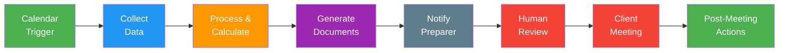

**Legend:**
- Green = Fully automated
- Blue = Automated with branching logic
- Orange = AI-assisted processing
- Purple = Automated document generation
- Red = Human-required steps

---

## 2. CURRENT MANUAL PROCESS

### 2.1 Process Steps (As Observed from Karen's Walkthrough)

The following 14 steps were identified from the transcript of Karen preparing
for a quarterly meeting with client "Candace":

```mermaid
flowchart TD
    S1[1. Open Karbon<br/>Review pending items<br/>⏱ 5 min] --> S2[2. Download pay stubs<br/>from payroll software<br/>Manual<br/>⏱ 5 min]
    S2 --> S3[3. Create folders in Drive<br/>File payroll docs<br/>⏱ 3 min]
    S3 --> S4[4. Open QBO<br/>Check bank feeds<br/>⏱ 5 min]
    S4 --> S5[5. Fix QBO rules<br/>Edit categorization<br/>⏱ 5 min]
    S5 --> S6[6. Mass reclassify<br/>transactions<br/>⏱ 10 min]
    S6 --> S7[7. Download P&L<br/>and Balance Sheet<br/>⏱ 5 min]
    S7 --> S8[8. Copy tax return<br/>Model estimated taxes<br/>⏱ 15 min]
    S8 --> S9[9. Enter W-2 withholding<br/>from pay stubs<br/>⏱ 5 min]
    S9 --> S10[10. Model entity<br/>tax savings<br/>⏱ 10 min]
    S10 --> S11[11. Research tax<br/>strategies<br/>⏱ 15 min]
    S11 --> S12[12. Build client<br/>scorecard<br/>⏱ 10 min]
    S12 --> S13[13. Write meeting<br/>agenda<br/>⏱ 5 min]
    S13 --> S14[14. Delegate tasks<br/>to team<br/>⏱ 3 min]

    style S1 fill:#4CAF50,color:#fff
    style S2 fill:#F44336,color:#fff
    style S3 fill:#4CAF50,color:#fff
    style S4 fill:#2196F3,color:#fff
    style S5 fill:#FF9800,color:#fff
    style S6 fill:#FF9800,color:#fff
    style S7 fill:#4CAF50,color:#fff
    style S8 fill:#FF9800,color:#fff
    style S9 fill:#FF9800,color:#fff
    style S10 fill:#FF9800,color:#fff
    style S11 fill:#FF9800,color:#fff
    style S12 fill:#FF9800,color:#fff
    style S13 fill:#FF9800,color:#fff
    style S14 fill:#4CAF50,color:#fff
```

**Color legend for current process:**
- Green = Can be fully automated
- Blue = Can be partially automated (detection, not resolution)
- Orange = Can be AI-assisted (human review required)
- Red = Manual by firm choice (payroll pay stubs are collected manually — no payroll dashboard connections)

### 2.2 Time Breakdown

| Step | Current Time | After Automation | Savings |
|------|-------------|-----------------|---------|
| 1. Review Karbon pending items | 5 min | 0 min (auto-pulled) | 5 min |
| 2. Download payroll | 5 min | ~5 min (Manual: team downloads + uploads pay stubs) | 0 min |
| 3. File documents | 3 min | 0 min (auto-filed) | 3 min |
| 4. Check QBO bank feeds | 5 min | 1 min (review auto-generated health report) | 4 min |
| 5. Fix QBO rules | 5 min | 2 min (AI suggests + human approves rules; n8n virtual rules engine applies them) | 3 min |
| 6. Mass reclassify transactions | 10 min | 3 min (approve proposed reclassification list; n8n applies via QBO API) | 7 min |
| 7. Download financials | 5 min | 0 min (auto-pulled or auto-requested) | 5 min |
| 8. Model estimated taxes | 15 min | 3 min (review auto-populated template) | 12 min |
| 9. Enter W-2 withholding | 5 min | ~1 min (AI reads uploaded pay stub + review) | 4 min |
| 10. Model entity savings | 10 min | 2 min (review auto-calculated comparison) | 8 min |
| 11. Research tax strategies | 15 min | 8 min (review AI research memo — Blue J findings composed by Claude; human validates) | 7 min |
| 12. Build scorecard | 10 min | 2 min (review auto-generated scorecard) | 8 min |
| 13. Write meeting agenda | 5 min | 2 min (review AI-drafted agenda) | 3 min |
| 14. Delegate tasks | 3 min | 0 min (auto-created in Karbon) | 3 min |
| **TOTAL** | **~101 min** | **~29 min** | **~72 min** |

**Notes:**
- "After Automation" times assume the client has API access to accounting (best case)
- Payroll is collected manually (team downloads and uploads pay stubs); the AI then parses the uploaded stub
- Reclassification (step 6) now follows a propose → approve → apply flow: Claude proposes categories, the human approves in a review sheet, and n8n applies the changes via the QBO API
- Categorization rules (step 5) run through n8n's virtual rules engine; Claude suggests new rules from recurring patterns and a human approves before activation
- Tax research (step 11) uses Blue J as the primary research engine; Claude composes a client-specific cited memo, and the professional validates all conclusions
- For non-API accounting clients, add ~10 min for document collection wait time
- Human review time cannot be eliminated — it ensures accuracy

---

## 3. AUTOMATED PROCESS DESIGN

### 3.1 Design Principles

1. **Modular:** Each sub-workflow operates independently and can be
   developed, tested, and maintained separately.

2. **Adaptive:** The system branches based on client profile to handle
   varying tech setups (API vs. manual, QBO vs. Xero vs. nothing).

3. **Fail-safe:** If any sub-workflow fails, the others continue.
   Failures are logged and flagged, never silently ignored.

4. **Human-in-the-loop:** AI generates drafts and calculations;
   humans review and approve before anything reaches the client.

5. **IRS-compliant:** Built entirely with synthetic data. No client
   data flows through development or third-party environments.

### 3.2 System Architecture Overview

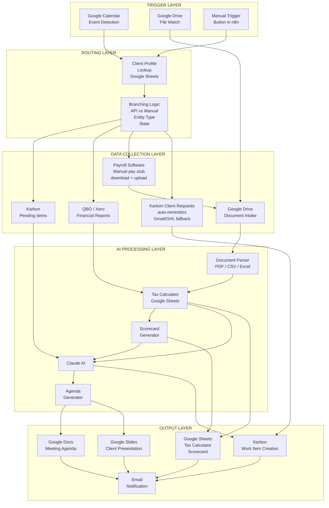

---

## 4. MASTER WORKFLOW ARCHITECTURE

### 4.1 Master Workflow: Quarterly Meeting Prep Pipeline

This is the orchestrating workflow that coordinates all sub-workflows.

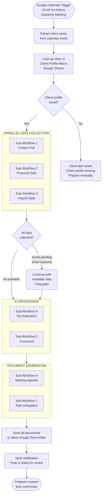

### 4.2 Trigger Configuration

**Primary Trigger: Google Calendar**
- Polls Google Calendar every 6 hours (or uses webhook)
- Looks for events in the next 24-48 hours
- Filters for events containing "Quarterly" in the title or a designated
  calendar label
- Extracts client name from the event title or description

**Secondary Trigger: Manual**
- n8n button that allows a team member to manually trigger the prep
  pipeline for any client at any time
- Useful for ad-hoc meetings or re-running after data updates

**Tertiary Trigger: Google Drive File Watch**
- Monitors client folders for newly uploaded documents
- When a file arrives (from a document request), triggers the intake
  sub-workflow to process it and continue the pipeline

---

## 5. SUB-WORKFLOW DETAILS

### 5.1 Sub-Workflow 1: Karbon Pending Items

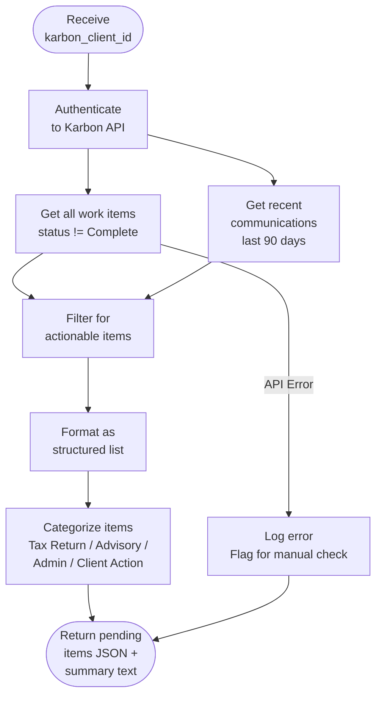

**API Details:**
- Endpoint: Karbon REST API
- Authentication: OAuth2 or API key
- Rate limits: Respect Karbon's rate limiting (varies by plan)

---

### 5.2 Sub-Workflow 2: Financial Data Collection

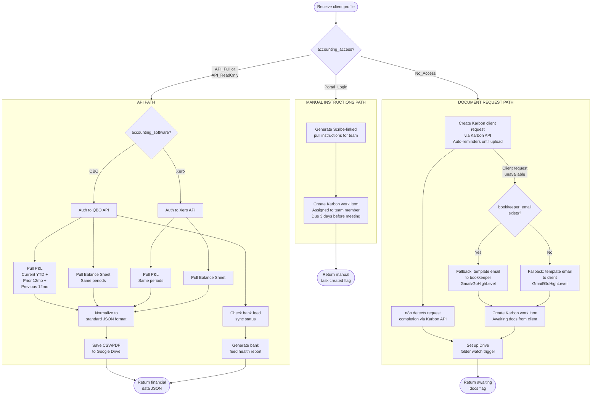

**Branch B (no accounting access) — how documents are requested:**

The primary mechanism is a **Karbon Client Request**: n8n creates the
request via the Karbon API, Karbon automatically reminds the client until
they upload the requested documents, and n8n detects completion via the
Karbon API. Templated emails via Gmail or GoHighLevel remain available as
a fallback when a client request cannot be used for a given contact.

**QBO API Details:**
- Base URL: `https://quickbooks.api.intuit.com/v3/company/{companyId}`
- Authentication: OAuth 2.0
- Reports endpoint: `/reports/ProfitAndLoss`, `/reports/BalanceSheet`
- Date parameters: `start_date`, `end_date`
- Sandbox: `https://sandbox-quickbooks.api.intuit.com`

**Xero API Details:**
- Base URL: `https://api.xero.com/api.xro/2.0`
- Authentication: OAuth 2.0
- Reports: `/Reports/ProfitAndLoss`, `/Reports/BalanceSheet`

---

### 5.3 Sub-Workflow 3: Payroll Data Collection

Payroll is collected **manually** — the firm does not connect via API to
client payroll dashboards. When a client has payroll, the team/admin
downloads the pay stubs from the client's payroll software and uploads them
to the client's Google Drive folder. The existing document-intake mechanism
(Claude AI parsing the uploaded pay stub PDF) then extracts the withholding
numbers and feeds the tax calculator. When there is no payroll system, the
step is skipped and the client is treated as distributions-only.

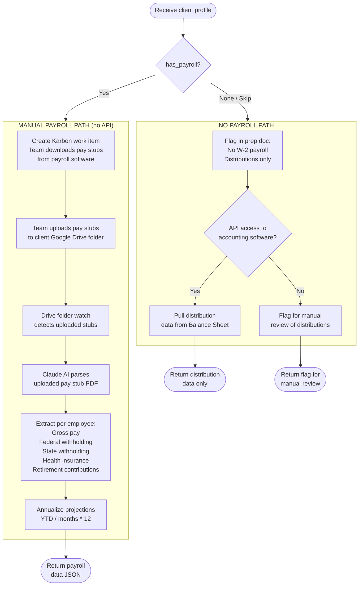

---

### 5.4 Sub-Workflow 4: Tax Estimation Engine

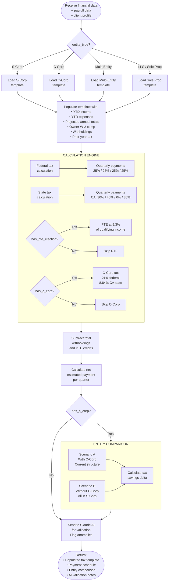

**State Tax Quarterly Schedules:**

| State | Q1 | Q2 | Q3 | Q4 |
|-------|-----|-----|-----|-----|
| California (individual) | 30% | 40% | 0% | 30% |
| Federal (individual) | 25% | 25% | 25% | 25% |
| California (C-Corp) | 30% | 40% | 0% | 30% |
| Federal (C-Corp) | 25% | 25% | 25% | 25% |

---

### 5.5 Sub-Workflow 5: Client Scorecard

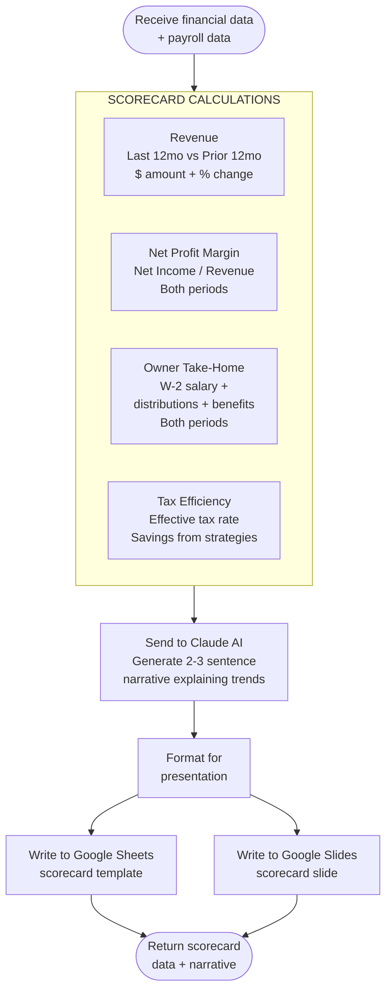

**Scorecard Output Format:**

```
┌─────────────────────────────────────────────────────────┐
│                  CLIENT SCORECARD                        │
│                  Q1 2026 Review                          │
├──────────────┬──────────────┬──────────────┬────────────┤
│   REVENUE    │  TAKE-HOME   │    PROFIT    │    TAX     │
│              │              │              │  SAVINGS   │
│  $XXX,XXX   │   $XX,XXX    │    XX.X%     │  $X,XXX    │
│   ▲ XX%     │    ▲ XX%     │    ▼ X.X%    │            │
│ vs prior yr  │ vs prior yr  │ vs prior yr  │ this year  │
└──────────────┴──────────────┴──────────────┴────────────┘

Narrative: Revenue grew 19% driven by the [company] acquisition.
Profit margin compressed slightly due to acquisition-related
interest expense. Take-home increased via distributions.
Tax savings of $9,256 from the new C-Corp entity structure.
```

---

### 5.6 Sub-Workflow 6: Meeting Agenda Generation

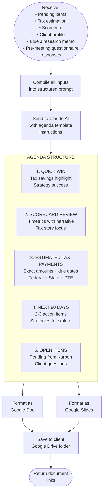

---

### 5.7 Sub-Workflow 7: Task Delegation

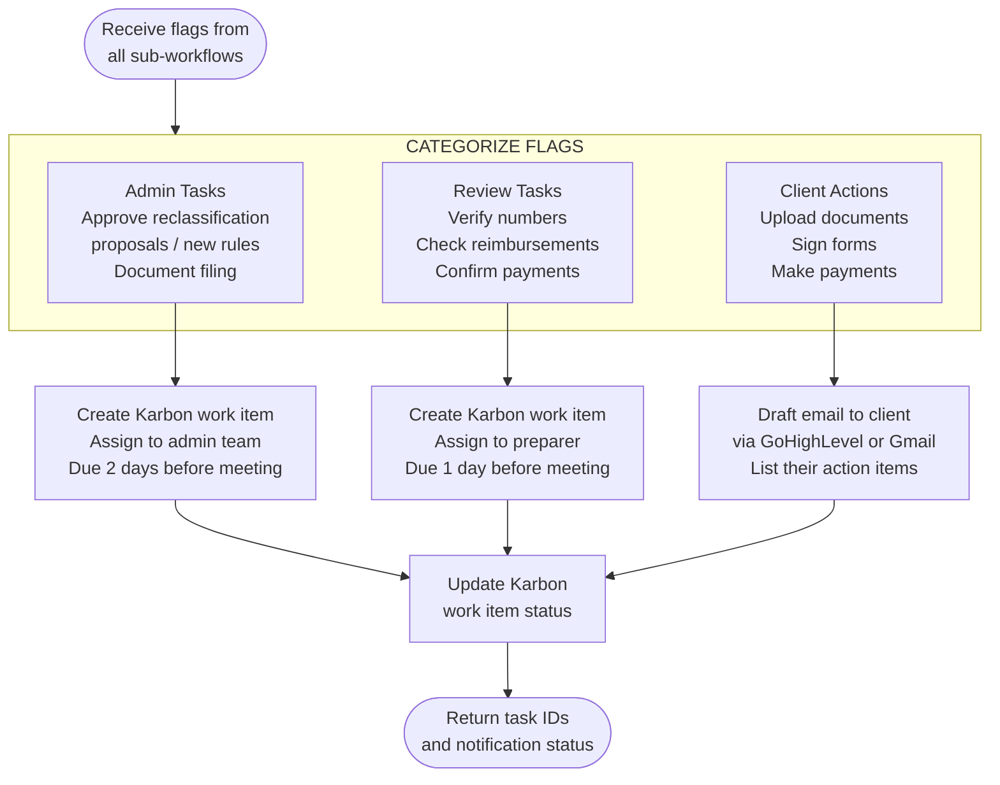

---

### 5.8 Sub-Workflow 8: Post-Meeting Actions (Fathom Integration)

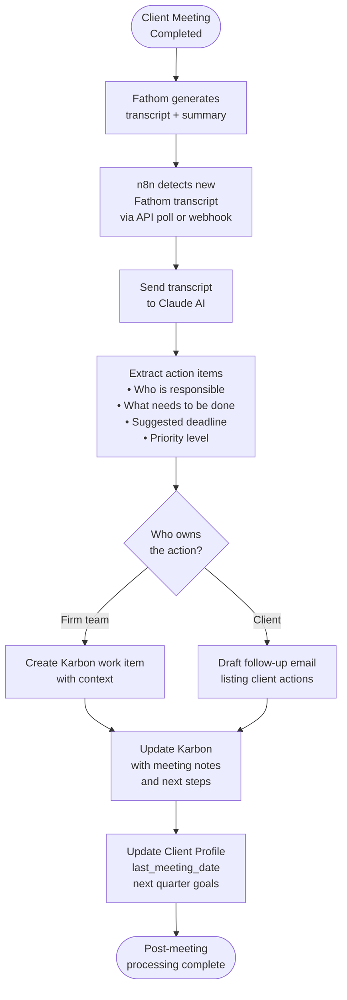

---

### 5.9 Sub-Workflow 9: Transaction Reclassification Engine

Mass reclassification is no longer a manual step. It follows a
**propose → approve → apply** pattern: n8n pulls uncategorized or
suspect transactions via the QBO API, Claude proposes a target category
and class for each transaction, the proposals land in a
"Reclassification Review" Google Sheet with Approve checkboxes, and once
approved, n8n applies the changes via QBO API batch/sparse updates. Every
change is written to a full audit log. If API-based updates are ever
insufficient, the fallback is SaasAnt Transactions (~$20/mo, optional) or
Antigravity RPA.

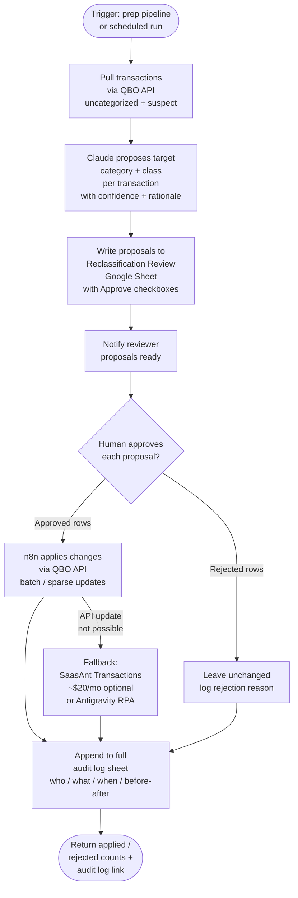

---

### 5.10 Sub-Workflow 10: Virtual Categorization Rules Engine

QBO's bank-feed categorization rules are **not editable via the QBO
API**, so instead of editing QBO's rules, n8n runs its own "virtual
rules engine" on a weekly schedule. Rules live in a Google Sheet
(description / amount / account match → category / class). n8n applies
matching rules directly to transactions via the QBO API, and Claude
suggests new rules from recurring patterns — a human approves every
suggested rule before it becomes active.

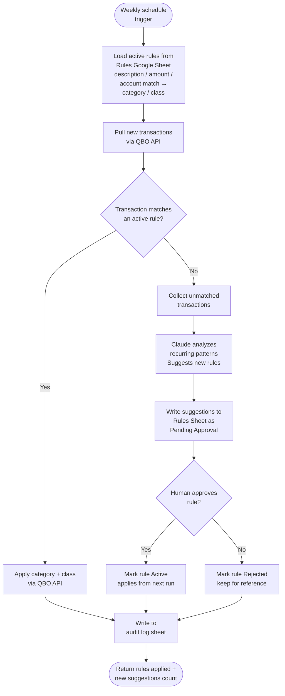

---

## 6. CLIENT PROFILE ADAPTIVE SYSTEM

### 6.1 How Profiles Drive Workflow Behavior

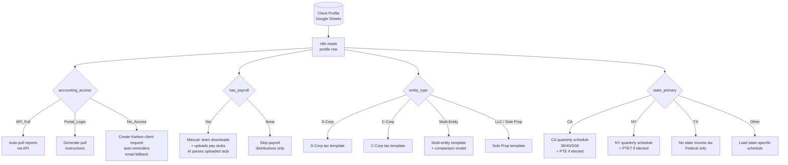

### 6.2 Client Profile Matrix Example

| Field | Client A | Client B | Client C |
|-------|----------|----------|----------|
| entity_type | S-Corp + C-Corp | S-Corp | Sole Prop |
| accounting_software | QBO | Xero | None |
| accounting_access | API_Full | API_Full | No_Access |
| payroll_software | Rippling | None | None |
| has_payroll | Yes (manual) | No | No |
| state_primary | CA | NY | TX |
| has_c_corp | Yes | No | No |
| has_pte_election | Yes | Yes | No |
| meeting_cadence | Quarterly | Quarterly | Semi_Annual |

**Workflow behavior per client:**

- **Client A**: Full automation — API pull from QBO, payroll collected
  manually (team downloads + uploads pay stubs, AI parses the uploaded
  stub), multi-entity tax template with comparison, CA PTE calculation,
  auto-generated scorecard and agenda.

- **Client B**: Partial automation — API pull from Xero (normalized
  to QBO format), no payroll (distributions only), single entity
  template, NY PTET calculation.

- **Client C**: Request-driven — Karbon client request created for the
  client (auto-reminders until upload; templated email as fallback),
  Drive watch trigger awaits uploads, Claude AI parses uploaded PDFs,
  simple sole prop tax template, federal only.

---

## 7. TAX ESTIMATION ENGINE

### 7.1 Calculation Flow

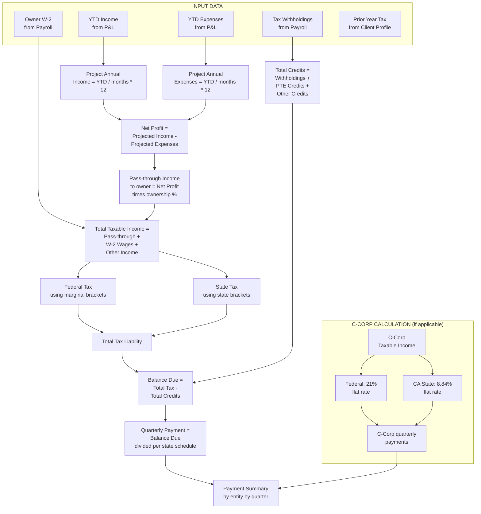

### 7.2 Entity Comparison Model

For multi-entity clients (S-Corp + C-Corp), the system calculates
both scenarios:

```
SCENARIO A: Current Structure (with C-Corp)
├── S-Corp pass-through income: $XXX,XXX
├── C-Corp taxable income: $XXX,XXX
├── Individual federal tax: $XX,XXX
├── Individual state tax: $XX,XXX
├── C-Corp federal tax: $XX,XXX
├── C-Corp state tax: $XX,XXX
└── TOTAL TAX: $XXX,XXX

SCENARIO B: Without C-Corp (all in S-Corp)
├── S-Corp pass-through income: $XXX,XXX (includes former C-Corp income)
├── Individual federal tax: $XX,XXX
├── Individual state tax: $XX,XXX
└── TOTAL TAX: $XXX,XXX

TAX SAVINGS = Scenario B Total - Scenario A Total = $X,XXX
```

---

## 8. SCORECARD AND MEETING OUTPUT

### 8.1 Meeting Prep Package

The complete output for each client meeting consists of:

```
Client Meeting Prep Package
├── 📊 Client Scorecard (Google Sheets)
│   ├── Revenue comparison (12mo vs prior 12mo)
│   ├── Profit margin comparison
│   ├── Owner take-home comparison
│   └── Tax savings / efficiency metrics
│
├── 🧮 Tax Estimation Calculator (Google Sheets)
│   ├── Projected annual income
│   ├── Estimated tax liability
│   ├── Quarterly payment schedule
│   ├── Entity comparison (if multi-entity)
│   └── AI validation notes
│
├── 📋 Meeting Agenda (Google Docs)
│   ├── Quick Win highlight
│   ├── Scorecard narrative
│   ├── Payment amounts and due dates
│   ├── Next 90 days action plan
│   └── Open items and questions
│
├── 🎯 Presentation Slides (Google Slides) [optional]
│   ├── Scorecard visual
│   ├── Tax savings visual
│   └── Next steps summary
│
├── ✅ Task List (Karbon work items)
│   ├── Pre-meeting prep tasks
│   ├── Items needing team action
│   └── Client follow-up items
│
└── 📌 Status Flags
    ├── Data gaps (what's missing)
    ├── Anomalies detected by AI
    └── Items requiring human judgment
```

### 8.2 Approval Gates & Client Touchpoints

Four conveniences wrap the prep pipeline in lightweight controls and
client-facing touchpoints:

1. **One-click approval gates.** The "prep is ready" email to the
   preparer includes **Approve** and **Request Changes** links, backed by
   an n8n human-in-the-loop webhook. Nothing client-facing (agenda,
   scorecard, payment schedule) is released until the preparer clicks
   Approve; Request Changes routes the package back with a comment field.

2. **Pre-meeting client questionnaire.** A short form (3-5 questions —
   e.g., major purchases planned, life/business changes, topics to
   discuss) is sent with the meeting reminder. Responses feed the agenda
   generator (Sub-Workflow 6 input), so the agenda reflects what the
   client actually wants to cover.

3. **Payment reminder workflow.** After the preparer approves the prep
   package, n8n schedules reminder emails to the client and the internal
   payments coordinator ahead of each federal and CA estimated-payment
   due date, including the exact amounts and direct links to EFTPS and
   CA FTB Web Pay.

4. **Monitoring.** Every execution appends a row to a run-log Google
   Sheet (client, trigger, steps completed, flags, duration, outcome). A
   free **Looker Studio** dashboard on top of that sheet shows prep
   status per client, missing documents, open flags, and upcoming
   meetings. Failures trigger an alert email immediately, and a weekly
   digest summarizes all runs.

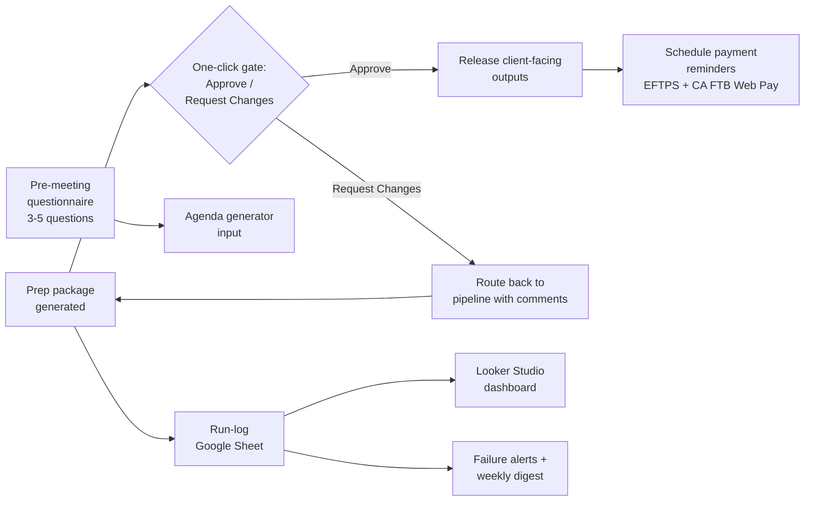

---

## 9. POST-MEETING AUTOMATION

### 9.1 Post-Meeting Flow

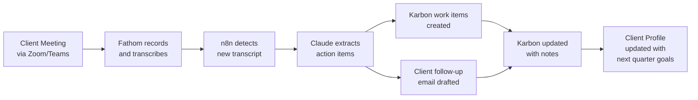

---

## 10. ERROR HANDLING AND EDGE CASES

### 10.1 Error Handling Strategy

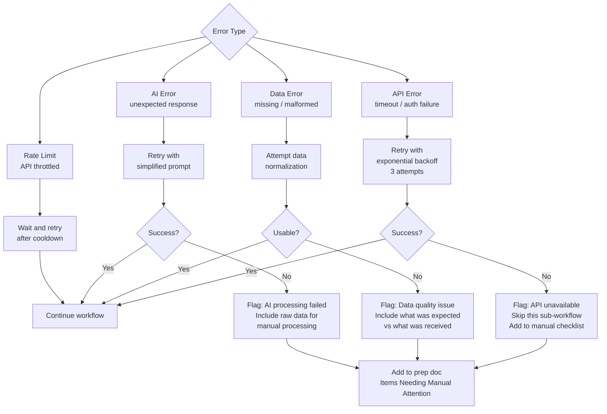

### 10.2 Common Edge Cases

| Edge Case | How the System Handles It |
|-----------|--------------------------|
| Client has no financial data yet (new client) | Skip scorecard, use simplified agenda, flag for discovery meeting |
| Payroll system changed mid-year | Use most recent payroll source, flag discrepancy for review |
| Multi-state client with different entity in each state | Load state-specific template for each entity, calculate separately |
| Client switched from S-Corp to C-Corp mid-year | Flag for manual tax calculation (complex transition rules) |
| QBO bank feed is months behind | Flag prominently: "Bank feeds last synced [date]. Financial data may be stale." |
| Prior year tax data not available | Use safe harbor estimate (110% of known prior year liability) or flag |
| Google Drive folder doesn't exist | Auto-create folder structure following naming convention |
| Calendar event has no client name | Send alert to preparer: "Calendar event found but client not identified" |

---

## 11. AUTOMATION CLASSIFICATION

### 11.1 Complete Summary

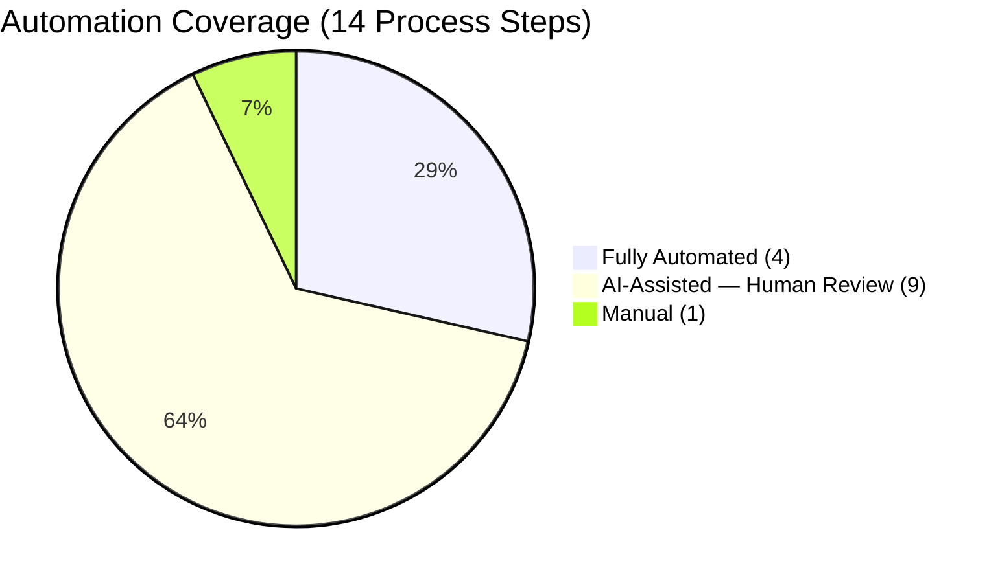

### 11.2 Detailed Classification

#### Fully Automated (4 steps — no human touch needed)

| Step | What | How |
|------|------|-----|
| 1. Karbon pending items | Pull open work items | n8n + Karbon API |
| 3. File organization | Create folders, save documents | n8n + Google Drive API |
| 7. Financial report download | Pull P&L and Balance Sheet | n8n + QBO/Xero API |
| 14. Task delegation | Create Karbon work items for team | n8n + Karbon API |

#### AI-Assisted — Human Review Required (9 steps)

| Step | What | AI Does | Human Does |
|------|------|---------|------------|
| 4. Bank feed review | Check bank sync and categorization | Detects anomalies, flags issues | Investigates root cause |
| 5. Categorization rules | Maintain n8n virtual rules engine (QBO bank-feed rules aren't editable via API) | Suggests new rules from recurring patterns; n8n applies active rules via QBO API weekly | Approves each suggested rule before activation |
| 6. Mass reclassify transactions | Propose → approve → apply reclassification | Proposes category/class per transaction; n8n applies approved changes via QBO API batch updates with audit log | Approves/rejects proposals in the Reclassification Review sheet |
| 8. Tax estimation | Calculate quarterly estimated payments | Populates template, validates | Reviews projections, applies judgment |
| 9. W-2 withholding entry | Read withholding from uploaded pay stub | Parses uploaded stub, populates tax template | Reviews extracted figures |
| 10. Entity comparison | Model tax with vs. without C-Corp | Calculates both scenarios | Validates assumptions |
| 11. Tax strategy research | Research strategies via Blue J + memo drafting | Blue J surfaces cited research; Claude composes a client-specific cited memo; NotebookLM cross-checks | Validates all conclusions and applies professional judgment |
| 12. Client scorecard | Build 4-metric performance report | Calculates metrics, writes narrative | Reviews narrative accuracy |
| 13. Meeting agenda | Draft structured meeting agenda | Generates from all collected data | Customizes, adds personal insights |

#### Manual — By Firm Choice (1 step)

| Step | What | Why It Stays Manual |
|------|------|----------------------|
| 2. Payroll download | Download pay stubs from payroll software, upload to Drive | By firm choice — no connections to client payroll dashboards; pay stubs are downloaded and uploaded manually. (Optional future avenue: a dedicated intake mailbox where clients email stubs in — still no payroll logins. See Future Enhancements.) |

---

## 12. IMPLEMENTATION ROADMAP

### 12.1 Phased Rollout

```mermaid
gantt
    title Implementation Roadmap (3 Weeks)
    dateFormat YYYY-MM-DD
    axisFormat %b %d

    section Week 1 - Foundation & Data Collection
    Client Profile + folders + email templates :p1a, 2026-07-01, 2d
    QBO + Xero auto-pull workflows              :p1b, 2026-07-01, 4d
    Karbon pending items pull                   :p1c, 2026-07-02, 2d
    Document request emails + Drive intake      :p1d, 2026-07-03, 3d
    Manual payroll upload + AI parse            :p1e, 2026-07-03, 3d
    Karbon client requests + auto-reminders     :p1f, 2026-07-03, 3d

    section Week 2 - Processing & Output
    Tax estimation templates                    :p2a, 2026-07-08, 3d
    Entity comparison model                     :p2b, 2026-07-09, 2d
    Scorecard generator + Claude AI             :p2c, 2026-07-08, 3d
    Meeting agenda generator + Slides           :p2d, 2026-07-10, 2d
    Karbon task creation + notifications        :p2e, 2026-07-10, 2d
    Fathom integration + action items           :p2f, 2026-07-11, 2d
    Reclassification engine (propose-approve-apply) :p2g, 2026-07-08, 3d
    Virtual rules engine                        :p2h, 2026-07-09, 3d
    Blue J research memo integration            :p2i, 2026-07-10, 2d
    Approval gates + payment reminders          :p2j, 2026-07-11, 2d
    Run log + Looker Studio dashboard           :p2k, 2026-07-11, 2d

    section Week 3 - Testing & Handoff
    Sandbox testing all scenarios               :p3a, 2026-07-15, 3d
    Documentation and training                  :p3b, 2026-07-15, 2d
    Production import and validation            :p3c, 2026-07-17, 2d
    Support period                              :p3d, 2026-07-18, 2d
```

### 12.2 Phase Details

| Phase | Duration | Cost | Dependencies |
|-------|----------|------|-------------|
| 1. Foundation & Data Collection | Week 1 | Developer cost (+ $0 internal setup) | None |
| 2. Processing & Output | Week 2 | Developer cost | Phase 1 |
| 3. Testing & Handoff | Week 3 | Developer cost + internal time | Phase 2 |
| **Total** | **~3 weeks (testing in the final week)** | | |

---

## 13. SOFTWARE INTEGRATION MAP

### 13.1 Full Integration Diagram

```mermaid
flowchart TD
    subgraph ORCHESTRATION["ORCHESTRATION (n8n)"]
        N8N[n8n Workflow Engine]
    end

    subgraph TRIGGERS["TRIGGERS"]
        GCAL[Google Calendar]
        GDRIVE_T[Google Drive<br/>File Watch]
    end

    subgraph DATA_SOURCES["DATA SOURCES (API)"]
        QBO[QuickBooks Online]
        XERO[Xero]
        KARBON_S[Karbon]
    end

    subgraph OFFLINE["MANUAL / OFFLINE SOURCES"]
        PAYROLL_SW[Payroll Software<br/>e.g. Rippling / Gusto / ADP<br/>Manual pay stub download]
    end

    subgraph AI["AI PROCESSING"]
        CLAUDE_S[Claude AI<br/>Anthropic API]
        CHATGPT[ChatGPT<br/>OpenAI API<br/>Backup]
        BLUEJ[Blue J Tax<br/>AI tax research<br/>cited findings<br/>used via UI]
    end

    subgraph PRODUCTIVITY["PRODUCTIVITY"]
        GSHEETS[Google Sheets]
        GDOCS[Google Docs]
        GSLIDES[Google Slides]
        GDRIVE[Google Drive]
        GMAIL[Gmail]
    end

    subgraph TASK_MGMT["TASK MANAGEMENT"]
        KARBON_T[Karbon<br/>Work Items]
    end

    subgraph COMMUNICATION["COMMUNICATION"]
        GHL[GoHighLevel]
        FATHOM_S[Fathom]
    end

    subgraph MONITORING["OUTPUT / MONITORING"]
        LOOKER[Looker Studio<br/>free dashboard<br/>run-log + prep status]
    end

    subgraph MANUAL_TOOLS["MANUAL / REFERENCE TOOLS"]
        PROCONNECT[ProConnect<br/>Tax Returns]
        NOTEBOOK[NotebookLM<br/>Research Cross-check]
        SCRIBE_S[Scribe<br/>Process Docs]
        ANTIGRAVITY_S[Antigravity<br/>RPA Fallback]
        SAASANT[SaasAnt Transactions<br/>~$20/mo optional<br/>bulk QBO edit fallback]
    end

    GCAL --> N8N
    GDRIVE_T --> N8N

    N8N --> QBO
    N8N --> XERO
    N8N --> KARBON_S

    PAYROLL_SW -.->|Manual download<br/>+ upload| GDRIVE

    N8N --> CLAUDE_S
    N8N --> CHATGPT
    BLUEJ -.->|Research findings<br/>pasted or uploaded<br/>via UI| CLAUDE_S
    NOTEBOOK -.->|Cross-check| CLAUDE_S

    N8N --> GSHEETS
    N8N --> GDOCS
    N8N --> GSLIDES
    N8N --> GDRIVE
    N8N --> GMAIL

    N8N --> KARBON_T

    N8N --> GHL
    N8N --> FATHOM_S

    GSHEETS -->|Run-log sheet| LOOKER
```

### 13.2 API Requirements Summary

| System | API Type | Auth Method | n8n Node | Sandbox Available |
|--------|----------|-------------|----------|-------------------|
| Google Calendar | REST | OAuth 2.0 | Built-in | Yes (test account) |
| Google Drive | REST | OAuth 2.0 | Built-in | Yes (test account) |
| Google Sheets | REST | OAuth 2.0 | Built-in | Yes (test account) |
| Google Docs | REST | OAuth 2.0 | Built-in | Yes (test account) |
| Google Slides | REST | OAuth 2.0 | HTTP Request | Yes (test account) |
| Gmail | REST | OAuth 2.0 | Built-in | Yes (test account) |
| QuickBooks Online | REST | OAuth 2.0 | Built-in | Yes (developer.intuit.com) |
| Xero | REST | OAuth 2.0 | Built-in | Yes (Xero demo company) |
| Payroll software (e.g. Rippling/Gusto/ADP) | None — manual/offline | N/A | N/A — pay stubs downloaded and uploaded to Google Drive by the team | N/A |
| Karbon (incl. Client Requests) | REST | API Key | HTTP Request | Contact Karbon |
| Claude AI | REST | API Key | Built-in | Yes (same API) |
| ChatGPT | REST | API Key | Built-in | Yes (same API) |
| Blue J Tax | Manual/limited — used via UI | Blue J login | N/A — research findings pasted/uploaded and fed to Claude for the memo | N/A |
| Looker Studio (free) | Native Google Sheets connector (no n8n API needed) | Google account | N/A — dashboard reads the run-log Sheet directly | Yes (test account) |
| SaasAnt Transactions (~$20/mo, optional) | File-based bulk import/export for QBO | SaasAnt login + QBO connect | N/A — optional fallback for bulk QBO edits | Trial available |
| GoHighLevel | REST | API Key | HTTP Request | Yes (test account) |
| Fathom | REST | API Key | HTTP Request | Contact Fathom |

---

## 14. APPENDIX

### 14.1 Complete System Flow — Single Diagram

```mermaid
flowchart TD
    START([24-48 hrs before<br/>Quarterly Meeting]) --> TRIGGER[Google Calendar<br/>Trigger fires]

    TRIGGER --> LOOKUP[Look up client<br/>in Profile Matrix]

    LOOKUP --> PARALLEL_COLLECT

    subgraph PARALLEL_COLLECT["PARALLEL DATA COLLECTION"]
        direction TB

        K[KARBON<br/>Pending items]

        F_CHECK{Accounting<br/>access?}
        F_CHECK -->|API| F_API[Pull QBO/Xero<br/>reports via API]
        F_CHECK -->|No API| F_EMAIL[Karbon client request<br/>auto-reminders<br/>email fallback]

        P_CHECK{Has<br/>payroll?}
        P_CHECK -->|Yes| P_MANUAL[Manual: team downloads<br/>+ uploads pay stubs<br/>AI parses uploaded stub]
        P_CHECK -->|None| P_SKIP[Flag distributions<br/>only]
    end

    PARALLEL_COLLECT --> DATA_READY{All data<br/>available?}

    DATA_READY -->|Yes| PROCESS
    DATA_READY -->|Partial| PROCESS
    DATA_READY -->|Waiting| DRIVE_WATCH[Set Drive watch<br/>Resume when<br/>docs uploaded]
    DRIVE_WATCH -->|Files arrive| PARSE_DOCS[Claude AI<br/>parses documents]
    PARSE_DOCS --> PROCESS

    subgraph PROCESS["AI PROCESSING + CALCULATIONS"]
        direction TB
        TAX[Tax Estimation<br/>Engine<br/>Google Sheets]
        COMPARE[Entity Comparison<br/>With vs Without<br/>C-Corp]
        SCORECARD[Client Scorecard<br/>4 metrics +<br/>AI narrative]
        RESEARCH[Tax Research Memo<br/>Blue J findings +<br/>Claude cited memo]
    end

    PROCESS --> GENERATE

    subgraph GENERATE["DOCUMENT GENERATION"]
        direction TB
        AGENDA_GEN[Meeting Agenda<br/>Claude AI draft<br/>Google Docs]
        SLIDES_GEN[Presentation<br/>Google Slides]
        TASKS_GEN[Task Delegation<br/>Karbon work items]
    end

    GENERATE --> SAVE_ALL[Save everything<br/>to Google Drive<br/>client folder]

    SAVE_ALL --> NOTIFY_PREP[Email notification<br/>to preparer<br/>Prep is ready]

    NOTIFY_PREP --> HUMAN_REVIEW[HUMAN REVIEW<br/>15-20 minutes<br/>Verify and customize]

    HUMAN_REVIEW --> GATE{One-click gate<br/>Approve /<br/>Request Changes}
    GATE -->|Request Changes| PROCESS
    GATE -->|Approve| CLIENT_MEETING[CLIENT MEETING<br/>Zoom/Teams]

    CLIENT_MEETING --> POST

    subgraph POST["POST-MEETING AUTOMATION"]
        direction TB
        FATHOM_PULL[Fathom transcript<br/>auto-detected]
        ACTION_EXTRACT[Claude AI extracts<br/>action items]
        TASK_CREATE[Karbon work items<br/>created]
        FOLLOWUP[Client follow-up<br/>email drafted]
        KARBON_UPDATE[Karbon updated<br/>with meeting notes]
    end

    POST --> NEXT([Ready for<br/>next quarter])
```

### 14.2 File Naming Conventions

All automated outputs follow this naming convention:

```
{ClientName}_QMP_{Quarter}{Year}_{DocumentType}.{ext}

Examples:
CandaceMyers_QMP_Q1-2026_Scorecard.xlsx
CandaceMyers_QMP_Q1-2026_TaxEstimate.xlsx
CandaceMyers_QMP_Q1-2026_Agenda.docx
CandaceMyers_QMP_Q1-2026_Presentation.pptx
CandaceMyers_QMP_Q1-2026_PayrollSummary.pdf
```

### 14.3 Google Drive Folder Structure

```
Client Root Folder/
├── 2026/
│   ├── Q1/
│   │   ├── Payroll/
│   │   │   ├── Justin_PayStub_Q1-2026.pdf
│   │   │   └── Candace_PayStub_Q1-2026.pdf
│   │   ├── Financials/
│   │   │   ├── PnL_YTD_Q1-2026.csv
│   │   │   └── BalanceSheet_Q1-2026.csv
│   │   ├── Tax/
│   │   │   ├── TaxEstimate_Q1-2026.xlsx
│   │   │   └── EntityComparison_Q1-2026.xlsx
│   │   └── Meeting/
│   │       ├── Scorecard_Q1-2026.xlsx
│   │       ├── Agenda_Q1-2026.docx
│   │       └── Presentation_Q1-2026.pptx
│   ├── Q2/
│   ├── Q3/
│   └── Q4/
└── Prior Years/
```

### 14.4 Future Enhancements (Optional Avenues)

These are optional avenues beyond the v1.1 scope — none are required for
the system to operate, and none change the locked decisions above:

- **Dedicated payroll intake mailbox.** Clients email their pay stubs to
  a dedicated address; n8n parses and files them automatically into the
  client's Drive folder. Still no payroll logins or dashboard
  connections — collection remains client-driven.
- **QBO Payroll passthrough (existing connections only).** For clients
  whose payroll runs inside QBO Payroll on an already-connected QBO
  account, payslips could be pulled through that same existing QBO
  connection — no new dashboards or logins are added.
- **AI-agent connectors (MCP).** MCP connectors for QuickBooks, Gmail,
  and Google Drive would enable ad-hoc, AI-driven prep runs outside n8n
  (e.g., "re-run the scorecard for Client A with the latest QBO data").
- **Client portal.** A simple portal for clients to upload documents and
  view their scorecard between meetings.

---

*End of Comprehensive Workflow Documentation*
